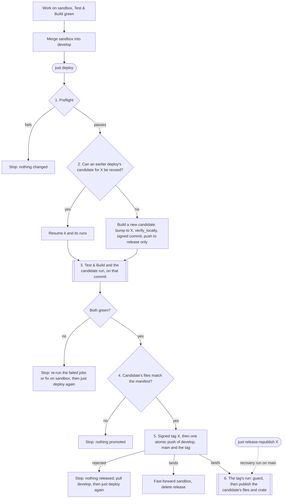
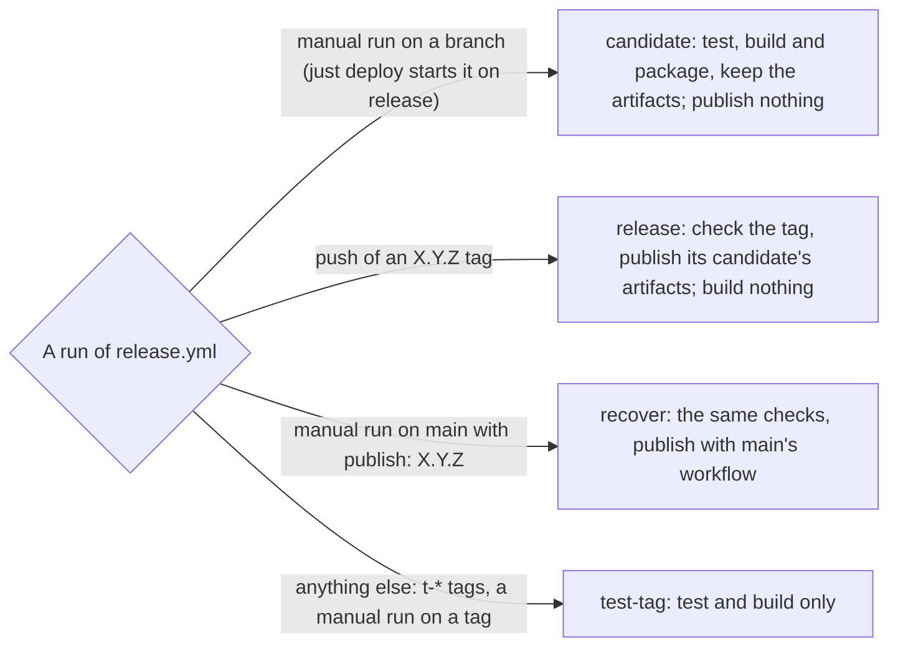

# cron-when

[](https://github.com/nbari/cron-when/actions)
[](https://codecov.io/gh/nbari/cron-when)
[](https://crates.io/crates/cron-when)
[](https://crates.io/crates/cron-when)
[](https://docs.rs/cron-when)
[](https://github.com/nbari/cron-when/blob/main/LICENSE)


A CLI cron expression parser that shows the next execution time and duration until then.

## Educational Template

**This project is intentionally over-engineered to serve as a learning template:**

- Demonstrates compile-time feature gating plus runtime configuration
- Shows how to integrate distributed tracing in Rust CLIs
- Exhibits modular CLI architecture with separation of concerns
- Uses pure Rust TLS implementation (rustls + webpki-roots, no OpenSSL)
- Includes comprehensive testing (unit + container integration tests)
- Applies strict clippy lints for code quality and safety
- Documents tradeoffs and architectural decisions

### Key Technical Decisions

- **TLS Implementation**: Pure Rust using `rustls` with `webpki-roots`
  - No system OpenSSL dependency required
  - Simplified cross-platform builds (especially Windows)
  - Same security guarantees, fully portable

- **OpenTelemetry Integration**: Compile-time optional through the `telemetry` feature
  - The default build omits the OTLP/gRPC/TLS dependency stack
  - Enabling the Cargo feature requires a rebuild; it is not a live feature toggle
  - When compiled in, `OTEL_EXPORTER_OTLP_ENDPOINT` activates export at process startup
  - Multi-backend support (Jaeger, Honeycomb, Grafana, AWS X-Ray, etc.)
  - Uses gRPC over TLS with rustls for secure trace export

- **Code Quality**: Strict clippy lints enforced
  - All `pedantic` lints enabled
  - Safety lints: no `unwrap()`, `expect()`, `panic!()`, or unsafe indexing in production code
  - Comprehensive error handling and documentation

See [`CLI_ARCHITECTURE.md`](CLI_ARCHITECTURE.md) for detailed discussion of design decisions.

### 🚀 Using This as a Template

This project is designed to be copied and adapted for your own Rust CLIs:

```bash
# 1. Copy the project
git clone https://github.com/nbari/cron-when my-new-cli
cd my-new-cli && rm -rf .git && git init

# 2. Update Cargo.toml
# - name = "my-new-cli"
# - authors, description, repository

# 3. What to keep vs replace:
# ✅ KEEP: src/cli/ (entire architecture)
# ✅ KEEP: .github/workflows/ (auto-detects package name)
# ✅ KEEP: Strict clippy lints, deny.toml
# 🔄 REPLACE: src/crontab.rs, src/output.rs (your domain logic)
# 🔄 UPDATE: src/cli/actions/mod.rs (your action enum)
```

**Why this makes a good template:**
- No system dependencies (pure Rust, no OpenSSL)
- Workflows auto-configure from Cargo.toml
- Strict quality standards enforced
- Production patterns included (observability, error handling, testing)

See [`.github/TEMPLATE.md`](.github/TEMPLATE.md) for detailed instructions.

## Features

- Parse individual cron expressions
- Display next execution time in UTC
- Show time remaining using human-readable duration format (e.g., "2d 3h 15m 30s")
- Parse current user's crontab (`crontab -l`)
- Read and parse crontab files
- Support for comments in crontab files
- Verbose output mode

## Installation

### Prerequisites

- Rust toolchain (no system dependencies required)
- This project uses pure Rust dependencies (rustls), so no OpenSSL installation needed

### From source

```bash
cargo install --path .

# Include the optional OpenTelemetry exporter
cargo install --path . --features telemetry
```

### From crates.io

```bash
cargo install cron-when

# Include the optional OpenTelemetry exporter
cargo install cron-when --features telemetry
```

### Building static binaries (Linux)

For fully static binaries that work on any Linux distribution:

```bash
# Install musl target
rustup target add x86_64-unknown-linux-musl

# Build static binary
cargo build --release --target x86_64-unknown-linux-musl
```

## Usage

### Basic usage with cron expression

```bash
# Run every 5 minutes
cron-when "*/5 * * * *"

# Daily at midnight
cron-when "0 0 * * *"

# Every Monday at 2:30 AM
cron-when "30 2 * * 1"
```

### Verbose mode

Show the cron expression along with the output:

```bash
cron-when -v "*/5 * * * *"
```

### Color Output

`cron-when` supports colored output for better readability. By default, color is enabled when the output is a terminal (TTY).

- Force color: `cron-when --color "*/5 * * * *"` or `-c`
- Disable color: `cron-when --no-color "*/5 * * * *"`

This tool respects the [NO_COLOR](https://no-color.org/) standard. If the `NO_COLOR` environment variable is present, even as an empty value, color output will be disabled by default unless explicitly overridden by the `--color` flag.

The detection hierarchy is:
1.  `--no-color` flag (always disable)
2.  `--color` flag (always enable)
3.  `NO_COLOR` environment variable (disable if present)
4.  `CLICOLOR_FORCE` environment variable (enable if set and not "0")
5.  Auto-detection (enable if output is a terminal)

### Show next N occurrences

Display the next N times a cron expression will run:

```bash
# Show next 10 occurrences
cron-when --next 10 "*/5 * * * *"

# Or use short flag
cron-when -n 5 "0 0 * * *"
```

**Output:**
```
Expression: */5 * * * *

  1. 2025-11-09 12:15:00 UTC (2m50s)
  2. 2025-11-09 12:20:00 UTC (7m50s)
  3. 2025-11-09 12:25:00 UTC (12m50s)
  4. 2025-11-09 12:30:00 UTC (17m50s)
  5. 2025-11-09 12:35:00 UTC (22m50s)
  ...
```

### Parse current user's crontab

```bash
cron-when --crontab
# or
cron-when -l
```

### Parse crontab from file

```bash
cron-when --file /path/to/crontab
# or
cron-when -f /path/to/crontab
```

### Example crontab file

```cron
# Backup database every day at 2 AM
0 2 * * * /usr/local/bin/backup.sh

# Clean temporary files every hour
0 * * * * /usr/local/bin/cleanup.sh

# Send weekly report every Monday at 9 AM
0 9 * * 1 /usr/local/bin/weekly-report.sh
```

## Output Format

```
Next: 2024-11-09 15:30:00 UTC
Left: 2h 15m 30s
```

With comments from crontab:

```
# Backup database every day at 2 AM
Next: 2024-11-10 02:00:00 UTC
Left: 10h 30m 0s

# Clean temporary files every hour
Next: 2024-11-09 16:00:00 UTC
Left: 2h 30m 0s
```

## Cron Expression Format

The tool supports standard cron expressions with 5 fields:

```
* * * * *
│ │ │ │ │
│ │ │ │ └─── Day of week (0-6, Sunday=0)
│ │ │ └───── Month (1-12)
│ │ └─────── Day of month (1-31)
│ └───────── Hour (0-23)
└─────────── Minute (0-59)
```

### Supported syntax

- `*` - Any value
- `,` - Value list separator (e.g., `1,3,5`)
- `-` - Range of values (e.g., `1-5`)
- `/` - Step values (e.g., `*/5` for every 5 units)

### Examples

- `*/5 * * * *` - Every 5 minutes
- `0 0 * * *` - Daily at midnight
- `0 */6 * * *` - Every 6 hours
- `30 2 * * 1-5` - At 2:30 AM, Monday through Friday
- `0 0 1 * *` - First day of every month at midnight
- `0 0 * * 0` - Every Sunday at midnight

## Options

```
Usage: cron-when [OPTIONS] [CRON_EXPRESSION]

Arguments:
  [CRON_EXPRESSION]  Cron expression (e.g., "*/5 * * * *")

Options:
  -f, --file <FILE>   Read from file (crontab format)
  -l, --crontab       Parse current user's crontab
  -v, --verbose...    Show verbose output with cron expression
  -n, --next <COUNT>  Show next N occurrences of the cron expression
  -h, --help          Print help
  -V, --version       Print version
```

## Observability & Tracing

This CLI offers OpenTelemetry support for distributed tracing and observability
through the optional `telemetry` Cargo feature. The default build remains a
smaller cron utility without the OTLP/gRPC/TLS dependency stack.

> **📚 Educational Note:** This is intentionally over-engineered! A simple cron parser doesn't "need" distributed tracing. However, this project demonstrates production-grade observability patterns that you can learn from and apply to your own projects. See the [compile-time versus runtime design](CLI_ARCHITECTURE.md#compile-time-feature-vs-runtime-configuration) for a detailed discussion.

### Two Controls, Two Purposes

This example deliberately separates compile-time capability from runtime
configuration:

| Control | What it does | Requires rebuilding? | When evaluated? |
| --- | --- | --- | --- |
| Cargo feature: `telemetry` | Includes the OpenTelemetry/OTLP implementation and its optional dependencies | Yes | At compile time |
| Environment: `OTEL_EXPORTER_OTLP_ENDPOINT` | Creates an OTLP exporter in a telemetry-enabled binary | No | Once, at process startup |

Cargo calls `telemetry` a *feature*. It is also commonly described as a
compile-time feature flag, but it is not the same as a runtime release toggle:
changing it produces a different binary and therefore requires rebuilding and
redeploying that binary.

The endpoint is runtime configuration. Adding or removing it does not require
a new binary, but this CLI reads it only during startup, so the process must be
restarted after the environment changes. It is not a live, remotely controlled
rollout flag.

The resulting behavior is:

| Binary | Endpoint set? | Result |
| --- | --- | --- |
| Default build | Either | Local structured logging only; OTLP code is not present |
| `--features telemetry` | No | Local structured logging only; no exporter is created |
| `--features telemetry` | Yes | Local structured logging plus OTLP trace export |

This is a good fit for an optional, dependency-heavy capability. Use Cargo
features to control what a binary can do. Use runtime configuration for values
that vary between environments. If a project needs instant rollouts, per-user
targeting, or a kill switch without restarting processes, use a dedicated
runtime feature-management mechanism instead.

CI checks and tests both feature sets, then performs cross-platform release
builds for both configurations. This catches code that compiles only when a
feature is enabled—or only when it is absent. Published release artifacts still
use the documented default feature set unless the release workflow explicitly
enables another feature.

### Enabling Traces

First build or install a binary that contains telemetry support:

```bash
cargo build --release --features telemetry
# or
cargo install cron-when --features telemetry
```

Then activate its OTLP exporter at startup by providing an endpoint:

```bash
export OTEL_EXPORTER_OTLP_ENDPOINT=http://localhost:4317
cron-when -v "*/5 * * * *"
```

### Using direnv

For convenience, you can use [direnv](https://direnv.net/) to automatically set environment variables:

```bash
# Copy the example file
cp .envrc.example .envrc

# Edit .envrc and uncomment the OTEL settings
# Then allow the directory
direnv allow
```

Example `.envrc` file:
```bash
export OTEL_EXPORTER_OTLP_ENDPOINT=http://localhost:4317
```

### Viewing Traces with Jaeger

Start Jaeger locally using Docker/Podman:

```bash
podman run -d --name jaeger \
  -e COLLECTOR_OTLP_ENABLED=true \
  -p 16686:16686 \
  -p 4317:4317 \
  jaegertracing/all-in-one:latest
```

Or use the justfile recipe:
```bash
just jaeger
```

Then access the Jaeger UI at [http://localhost:16686](http://localhost:16686)

### Supported Backends

The OTLP exporter works with any OpenTelemetry-compatible backend:

- **Jaeger** - Open source tracing
- **Honeycomb** - `OTEL_EXPORTER_OTLP_ENDPOINT=https://api.honeycomb.io:443`
- **Grafana Tempo** - Self-hosted or cloud
- **AWS X-Ray** - Via OpenTelemetry Collector
- **Google Cloud Trace** - Via OpenTelemetry Collector

### Additional Configuration

```bash
# Custom headers (e.g., for authentication)
export OTEL_EXPORTER_OTLP_HEADERS="x-honeycomb-team=YOUR_API_KEY"

# Service instance ID (auto-generated if not set)
export OTEL_SERVICE_INSTANCE_ID=my-instance-123

# Override log level
export RUST_LOG=debug
```

### Verbosity Levels

Combine with `-v` flags for different log levels:

```bash
cron-when -v "*/5 * * * *"    # INFO level
cron-when -vv "*/5 * * * *"   # DEBUG level
cron-when -vvv "*/5 * * * *"  # TRACE level
```

### Known Behavior: Flush Timeout

When tracing is enabled, you may see a timeout error on exit:

```
ERROR BatchSpanProcessor.Shutdown.Timeout
```

**This is expected and harmless!** The CLI exits faster (~10ms) than the span processor can flush (~5s). Your traces are still sent and will appear in Jaeger/Honeycomb/etc.

To suppress these messages:
```bash
export RUST_LOG="warn,opentelemetry_sdk=error"
```

See [CLI_ARCHITECTURE.md](CLI_ARCHITECTURE.md) for details on why this happens and alternative approaches.

## Development

### Development container

The repository includes a development container based on the setup used by
`s3m`, updated to the current Dev Container schema. It provides Rust, Clippy,
rustfmt, the MUSL target, the Cargo tools used by the `just` recipes, SOPS,
age, zsh, rust-analyzer, and debugging extensions.

In VS Code, install the **Dev Containers** extension, open this repository, and
select **Dev Containers: Reopen in Container**. Other tools implementing the
[Development Container Specification](https://containers.dev/) can use the
same `.devcontainer/devcontainer.json` file.

The container uses the non-root `vscode` user. Run the fast validation suite
after creation:

```bash
just test
```

For Fedora/Podman compatibility, the container disables SELinux label
separation for this development container. This lets the workspace and the
read-only staged secret be mounted without relabeling either host path. It does
not make the container privileged, but derived projects should keep this option
only when their container provider requires it.

`just full-test` additionally requires access to a Podman service. The base
container does not request privileged access or mount a host container-engine
socket automatically; configure that explicitly if your derived project needs
container integration tests.

#### Optional SOPS and age secrets

The container supports SOPS-encrypted files without storing a private age key
in Git. Before creating or rebuilding it, choose one host-side source:

```bash
# Recommended: a protected file outside this repository
export SOPS_AGE_KEY_FILE="$HOME/.config/sops/age/keys.txt"

# Or resolve the identity through the 1Password CLI
export SOPS_AGE_KEY_OP_REF='op://YOUR_VAULT/YOUR_ITEM/password'

# Direct values are supported for automation but are easier to leak
# export SOPS_AGE_KEY='AGE-SECRET-KEY-...'
```

The host initializer copies the selected identity to
`~/.cache/devcontainer-secrets/cron-when/sops-age-key` with mode `0600`. The
container receives that file read-only at `/run/secrets/sops-age-key` and sets
`SOPS_AGE_KEY_FILE` accordingly. If no identity is configured, container
creation still succeeds, but decryption is unavailable.

To start using encrypted repository files:

```bash
# Generate an identity outside the repository if you do not already have one
mkdir -p "$HOME/.config/sops/age"
age-keygen -o "$HOME/.config/sops/age/keys.txt"
chmod 600 "$HOME/.config/sops/age/keys.txt"

# Configure only the public recipient in Git
cp .sops.yaml.example .sops.yaml
age-keygen -y "$HOME/.config/sops/age/keys.txt"
# Replace the placeholder in .sops.yaml with the printed age1... recipient

# Create or edit an encrypted file
sops secrets/example.sops.yaml
```

Commit `.sops.yaml` and encrypted `*.sops.*` files. Never commit the age
identity, plaintext secret files, or decrypted output. Removing access to a
password manager does not revoke an age identity someone already possesses;
rotate the identity and re-encrypt affected files when access is revoked.

### Running tests

```bash
# Test the default, minimal feature set
cargo test

# Test every optional Cargo feature
cargo test --all-features

# Fast local checks
just test

# Includes the MUSL/Podman integration test
just full-test
```

### Building

```bash
# Minimal binary (the default)
cargo build --release

# Binary with optional OTLP telemetry support
cargo build --release --features telemetry
```

### Running locally

```bash
cargo run -- "*/5 * * * *"
```

### Releasing

The release flow follows one rule: **the commit that is tagged and put on `main` is
exactly the commit CI tested, and the published files are exactly the files CI built.**
`just deploy` promotes a commit only after every test, build and package passed on it,
so a release never needs a tag deleted or moved. GitHub enforces the rest: branch
protection lets onto `main` only commits whose **CI OK** check passed, and the Deploy
workflow publishes a tag only with the successful candidate run the signed tag names. Everything lives in
`scripts/release` (driven by the `just` recipes below), `.github/workflows/build.yml`
(Test & Build) and `.github/workflows/release.yml` (Deploy). This repository is also the
template for other projects; see [Using this as a template](#using-this-as-a-template).

#### Day to day

Work, including dependency updates (`just update`), lands on `sandbox`. When its
**Test & Build** run is green, merge it into `develop` and run `just deploy` from a clean
`develop`.

| Command | What it does |
|---|---|
| `just deploy` | Release a patch bump (`deploy-minor`, `deploy-major` for the others); when `develop`'s current version has no tag yet, it releases that version as is instead |
| `just deploy-current` | Release `develop`'s untagged version as is, explicitly |
| `just release-status` | Show `develop`, `main`, the staged candidate, its runs and the last tag's publish run |
| `just release-preflight` | Run only the checks; changes nothing apart from fetching |
| `just release-republish X.Y.Z` | Recovery: publish an existing tag again with `main`'s workflow |
| `just protect-branches` | Apply the branch protection the flow relies on |
| `just t-deploy` | Push a `t-*` test tag: tests, builds and packages, publishes nothing |

#### What `just deploy` does



Double-bordered steps run in GitHub Actions; the others run on your machine. Every
"Stop" leaves the tag uncreated and `develop` and `main` untouched, so rerunning
`just deploy` is always safe. In detail:

```
sandbox ──(CI green)──▶ merge into develop ──▶ just deploy
 1. preflight       read-only: clean develop equal to origin, main can fast-forward,
                    gh logged in, git can sign, valid settings
 2. candidate       reuse the candidate an earlier, interrupted deploy left on `release`
                    when it is still exactly right (named "bump version to X", signed,
                    directly on the current develop, X untagged, nothing but the bump);
                    otherwise build a new one in a temporary worktree under .git: bump
                    the version (Cargo.toml and Cargo.lock only), run `just full-test`,
                    make a signed commit "bump version to X", and push it to the scratch
                    `release` branch only (a stale former candidate is replaced and kept
                    as a local backup ref until X is released; anything else is refused)
 3. two CI runs     on that exact commit, in parallel:
                    • Test & Build
                    • Deploy in candidate mode (a manual run on `release`): every test,
                      every build and package (Linux x86_64/arm64 musl, macOS, Windows,
                      RPM, DEB, archives), the crate packaged and verified, all kept as
                      artifacts with a manifest of their SHA-256 sums; nothing published
 4. pre-tag check   download the manifest and every artifact, check the commit, the
                    version and every checksum, exactly as the tag's run will
 5. promotion       one atomic, fast-forward-only push: develop + main + the signed tag
                    X, whose message names the candidate run; then it tries to bring
                    sandbox in step and delete `release` (warnings say when it cannot)
 6. tag run         Deploy again, publish only: the guard checks the tag (signature, on
                    main, version, Test & Build, the named candidate run), then the
                    GitHub release gets exactly the manifest's files (stray ones are
                    removed; it is marked Latest only while the tag is the highest
                    promoted release) and the crate goes to crates.io; nothing is built
```

`just deploy` ends at step 5 ("Promoted"); step 6 runs in GitHub, and
`just release-status` shows its state. The `X.Y.Z` tag is the only tag the flow
creates, once, after everything that can break has passed.

#### The release manifest

The candidate run's last job, `manifest`, first checks that every build of the matrix
is there with its expected number of files (`EXPECTED`), then records exactly what the
run built in a small artifact named `release-manifest`. It ties what was tested to what
is published: `just deploy` downloads it and every artifact it lists before tagging, the
signed tag names the run it came from (`Candidate run: <id>`), and the tag's run and
recovery runs publish only what it lists. Recovery therefore works while the candidate
run's artifacts are kept (90 days by default).

| File | Content (zsmtp 0.1.2, for example) | Used for |
|---|---|---|
| `release.env` | `VERSION=0.1.2`, `COMMIT=<candidate commit>`, `RUST=1.98.1` | Refusing a manifest for another version or commit; repackaging the crate with the toolchain that packaged it |
| `SHA256SUMS` | The SHA-256 of every release file | Checked before tagging and again in the tag run; published as the release's own `SHA256SUMS` |
| `CRATE.SHA256` | `<sha256>  zsmtp-0.1.2.crate` | The crate goes to crates.io only when the repackaged one has this checksum, and crates.io must report it afterwards |
| `ARTIFACTS` | `dist-x86_64-unknown-linux-musl`, `dist-x86_64-apple-darwin`, `crate` | The artifacts the release needs: each must exist and hold exactly the listed files |
| `IMAGES` | Projects with container images only (permesi, crono): `<image> sha256:<index digest>` | The tag run adds `X.Y.Z` (and `X.Y`, `latest` while it is the highest release) to exactly these digests |

#### How release.yml treats each run

One workflow file, `.github/workflows/release.yml`, serves every kind of run; its
first job, the guard, decides what a run may do:



#### When something fails

| What failed | What to do |
|---|---|
| Before step 5 (a test, a build, packaging, the pre-tag check) | Nothing moved: no tag, `develop` and `main` untouched. Re-run the failed jobs in GitHub (the waiting deploy continues by itself within 15 minutes), or fix on `sandbox` and merge; then `just deploy` again |
| The deploy was interrupted (Ctrl-C, SSH dropped, GitHub outage, `RELEASE_NO_WAIT=1`) | `just deploy` again: it resumes the same candidate and the same runs |
| A publish step in the tag run (GitHub or crates.io outage) | "Re-run failed jobs" on the tag run; the release is updated in place and an already uploaded crate is accepted only with the tested checksum |
| The tag run's own workflow was wrong, or its 30-day re-run window passed | Fix the workflow, release as usual, then `just release-republish X.Y.Z`: a recovery run on `main` checks that tag like its own run would and publishes its candidate artifacts. The tag never moves |

Rerunning `just deploy` is always safe: it never bumps twice, never tags without passing
runs, and at worst stops again and says what is missing. A third-party service that is
not a real gate (the Coveralls upload) must not fail CI: its step uses
`fail-on-error: false`.

#### Guarantees and limits

- **Idempotent.** The release state is the `release` branch plus a local note of the
  candidate run this clone dispatched. A rerun resumes a valid candidate (signed, on the
  current `develop`, exactly the version bump, untagged), replaces a stale one (the old
  tip is kept as the local ref `refs/backup/release/<sha>` until its version or a later one
  is released, then removed), refuses anything else found on `release`,
  and says "nothing new to release" when `develop` is the last release, meaning tagged
  with the tag on `main`. A tag `main` lacks was never published; the deploy stops and
  explains the way out. Local `develop` is only ever fast-forwarded when origin's tip is
  exactly such a release; any other difference asks you to pull first.
- **What ships is what was tested.** The release files are the candidate run's
  artifacts, checked by SHA-256 before the tag and again in the tag run. cargo cannot
  upload a prepared `.crate`, so `cargo publish` repackages the tag's source with the
  candidate's toolchain, without building. That is byte-reproducible, and the checksum is
  compared with the manifest before the upload and with crates.io's after it.
- **Nothing rolls back.** Steps that follow the newest release (here GitHub's Latest
  flag) ask `.github/actions/release-is-latest` at the moment they act, and the release
  job runs one at a time across tags (`queue: max`), so a late, re-run or recovered job
  of an older tag never takes it back. A tag made by this flow cannot be misused either:
  a manual run on a tag is a test build, and recovery always runs `main`'s workflow.
- **Limits.** Recovery needs the candidate run's artifacts to be unexpired (90 days by
  default; check each repository's Actions retention setting), and "Re-run failed jobs"
  works for 30 days; beyond that, the next patch release is the way forward. The script follows the run id `gh workflow run` prints; with an older
  `gh` that prints none, it waits 15 minutes before dispatching again. Signing uses your
  SSH agent: if it is locked, the deploy stops before anything is promoted (the preflight
  already tries a signature; at worst a candidate is left on `release`), and a rerun
  resumes once it is unlocked. Tags created before a project adopted this flow keep the
  workflows they were tagged with: never dispatch a workflow on such a tag or re-run its
  old run, since that old code publishes without any of these checks; publish again with
  `just release-republish X.Y.Z`, which runs `main`'s workflow.

#### Settings

`RELEASE_POLL_SECONDS` (30), `RELEASE_CI_TIMEOUT` (3600, per attempt) and
`RELEASE_RERUN_WAIT` (900, after a failed attempt) are in seconds; the script polls every
10 seconds until a run appears, for up to 5 minutes. `RELEASE_NO_WAIT=1` stops once the
candidate is staged, or while CI still runs, and a later `just deploy` finishes. Run a
waiting deploy inside Herdr or tmux on a remote machine, so a dropped connection does not
stop it.

#### Using this as a template

The flow is generic; each project adapts the edges. Copy these files and adapt them as
described:

| File | What to adapt |
|---|---|
| `scripts/release` | The configuration block at the top: branches (`DEVELOP_BRANCH` equal to `MAIN_BRANCH` for a trunk-only repository), `CI_WORKFLOW`, `REQUIRED_CHECK`, `CANDIDATE_WORKFLOW` (empty when there is nothing to package), `CANDIDATE_MANIFEST`, `MAIN_PUSH_RESTRICTIONS` and `REQUIRE_CONVERSATION_RESOLUTION` (copy the repository's current values), `RELEASE_FILES`, and the `current_version`, `version_at`, `apply_bump` and `verify_locally` functions. Keep the bump cheap and deterministic: it is replayed to check a resumed candidate |
| `.justfile` | The release recipes above, plus whatever `verify_locally` runs (here `just full-test`) |
| `.github/workflows/build.yml` | Must run on every branch push, `release` included, and end with the aggregate **CI OK** job listing the jobs that are real gates. Skip per-branch side effects (preview deploys) for `release` |
| `.github/workflows/release.yml` | Keep the guard (`candidate`, `release`, `recover`, `test-tag`), the manifest job and the GitHub release job (with its latest check, the stray-file cleanup and its concurrency group, renamed for the project); replace the build and package jobs with the project's own, and keep the manifest job's `EXPECTED` inventory in step with the build matrix. Every file of every artifact the release uses must be in the manifest's checksum lists. The `crate` and `publish` jobs are for crates.io: adapt them to the project's destinations (images, registries), or, when nothing goes to crates.io, remove them together with everything in the `manifest` job that depends on them: `crate` in its `needs`, the "Download this run's crate" step, the `RUST` variable, its check and its `release.env` line, the `CRATE.SHA256` line, and `crate` in `ARTIFACTS` |
| `.github/actions/release-is-latest/action.yml` | Nothing, when the version lives in the root `Cargo.toml` and the main branch is `main`; otherwise its version lookup and branch name. Every step that follows the newest release (Latest flag, `latest` image tags, a production deploy, docs) calls it right before acting |
| `.github/actionlint.yaml` | Only while actionlint does not know the concurrency `queue` key: it ignores that one message for `release.yml` |
| `.github/workflows/coverage.yml` | Third-party uploads never fail the job |

These are project-specific, so copy or replace them as the project needs:

- the reusable workflows the two above call: `test.yml`, `containers.yml`,
  `security-audit.yml` and `coverage.yml`;
- local test helpers such as `scripts/validate-integration-test.sh` (used by
  `just full-test`);
- the package metadata in `Cargo.toml` (`[package.metadata.deb]`,
  `[package.metadata.generate-rpm]`: asset paths and package names) and `deny.toml`;
- a committed `Cargo.lock`: the workflows build with `--locked`, and the bump updates it.

Some names appear in more than one file and must stay consistent. The Deploy guard in
`release.yml` names the main branch (`main`), the CI workflow (`build.yml`), its own path
(`.github/workflows/release.yml`) and reads the version from `Cargo.toml`, so it must
match `MAIN_BRANCH`, `CI_WORKFLOW`, `CANDIDATE_WORKFLOW` and `version_at`. Before the
first release, search the copied files for `main`, `develop`, `sandbox`, `build.yml`,
`release.yml`, `Cargo.toml` and the old project name. A trunk-only repository also needs
the recipes that check for a `develop` branch (`check-develop`, used by `t-deploy`)
adapted, and uses its one branch wherever the steps below say `main` or `develop`.

Workstation and repository setup:

- Tools: `just`, `jq`, `gh` (`gh auth login`), `cargo-edit` (for `cargo set-version`),
  and whatever `verify_locally` needs. Here that is the
  `x86_64-unknown-linux-musl` target with musl tools and a working Podman for the
  integration test; see [Development](#development).
- An account with push, workflow dispatch and administration rights on the repository,
  Actions enabled, and the referenced actions allowed.
- An SSH or GPG signing key that is also registered on GitHub as a *signing* key: commits
  and tags must be signed, and the tag run requires GitHub to verify the tag's signature.
- Secrets for what the tag run publishes (`CRATES_TOKEN` here; `CODECOV_TOKEN` is
  optional).
- `just protect-branches` **replaces** the protection of the main and develop branches.
  Always: `main` requires **CI OK** (and no other check) with admins included, both
  require signed commits and linear history and allow no force pushes or deletions,
  required pull request reviews are removed, and `develop` gets no push restrictions.
  From the configuration block: push restrictions on `main` and conversation
  resolution. A project that needs more (reviews, other required checks) must edit
  `protect()` itself before running it.

Bootstrapping a project:

1. Make sure `main`, `develop` and the work branch exist, and that `main` is the
   repository's default branch (`gh api repos/OWNER/REPO --jq .default_branch`). Copy
   and adapt the files above on the work branch and push it; wait for Test & Build, and
   check that the **CI OK** check appears on the commit.
2. Land the adapted files on `main` first (merge the work branch while `main` is not
   protected yet), then fast-forward `develop` to that `main` commit (reconcile first if
   `develop` has commits of its own), and check
   `git merge-base --is-ancestor origin/main origin/develop`: GitHub only allows manual
   runs of a workflow that exists on the default branch, the release flow starts its
   candidate run that way, and the preflight requires `main` to be able to fast-forward
   to `develop`.
3. Try the candidate pipeline without releasing anything:
   `gh workflow run release.yml --ref sandbox`. It must pass and keep its
   `release-manifest` artifact.
4. Back up the current protection (`gh api repos/OWNER/REPO/branches/main/protection`, and
   the same for `develop`), run `just protect-branches`, and read both back.
5. Run `just release-preflight`, then the first `just deploy` from `develop`, and check
   the tag run's GitHub release and packages (`just release-status`).
