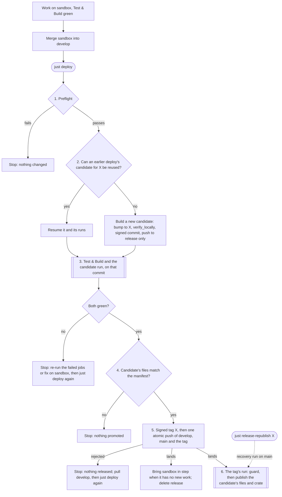
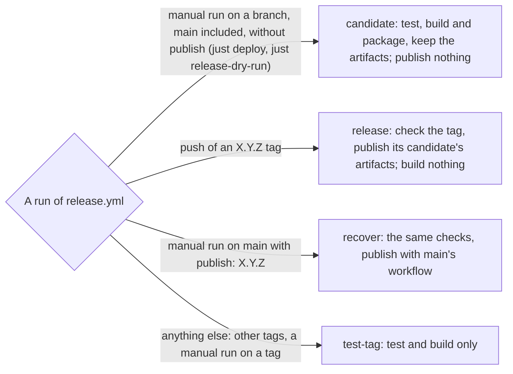

# Releasing

This project releases with one command, `just deploy`, and follows one rule:

> **The commit that is tagged and put on `main` is exactly the commit CI tested, and
> everything published is exactly what CI built.**

The flow is the reason this repository exists as a template. Copy it to your own
project and a release stops being a list of manual steps that can half-succeed.

- [Why this flow](#why-this-flow)
- [Terms](#terms)
- [Day to day](#day-to-day)
- [How a release works](#how-a-release-works)
- [The release manifest](#the-release-manifest)
- [How release.yml treats each run](#how-releaseyml-treats-each-run)
- [When something fails](#when-something-fails)
- [Guarantees and limits](#guarantees-and-limits)
- [Security](#security)
- [Verifying a release](#verifying-a-release)
- [Settings](#settings)
- [Requirements](#requirements)
- [Adopting this flow in another project](#adopting-this-flow-in-another-project)

## Why this flow

The usual release routine is: bump the version in `Cargo.toml` by hand, commit, tag,
push the tag, and let CI build and publish. It fails in ways that are hard to undo.
The tag is pushed before anyone knows whether the packages build; when the Windows
archive or the RPM fails, the tag has to be deleted and pushed again, the crate may
already be on crates.io while the binaries are not, and `main` holds a version bump
for a release that never happened. Every retry is another chance to get it wrong.

Here every test, build and package passes before the tag exists; only publishing
happens after it. `just deploy` makes the version bump
on a scratch branch, lets CI test that exact commit and build and package everything
from it, checks the result, and only then creates the tag and moves `develop` and
`main`, in one atomic push. The tag's own run builds nothing: it publishes the files
the candidate run already built and checksummed. A failed step before the tag leaves
nothing to clean up; rerunning `just deploy` resumes where it stopped. If publishing
itself fails (a GitHub or crates.io outage), re-running the failed job once the outage
clears finishes it (GitHub allows re-runs for 30 days; after that, recovery works while
the candidate's artifacts are kept); the tag never moves.

## Terms

| Term | Meaning |
|---|---|
| `develop`, `main` | `develop` collects work that is ready to release; `main` only ever holds released commits. Both move only by fast-forward. |
| work branch (`sandbox`) | Where day-to-day work lands. It is merged into `develop` when ready; after a release it is brought back in step with `develop` when it holds nothing `develop` lacks. |
| candidate | The signed commit `bump version to X.Y.Z` on top of `develop`, built by `just deploy` and pushed only to the scratch `release` branch. |
| candidate run | A manual run of `release.yml` on the candidate: every test, build and package, kept as run artifacts, publishing nothing. |
| manifest | The candidate run's record of exactly what it built: checksums, version, commit, toolchain. See [The release manifest](#the-release-manifest). |
| promotion | The single atomic push that moves `develop`, `main` and the new signed tag `X.Y.Z` to the candidate. |
| tag run | The run of `release.yml` the tag push starts. It publishes the candidate's files; it never builds. |
| guard | The first job of `release.yml`. It decides what a run may do and refuses to publish a tag that did not come through this flow. |
| **CI OK** | The aggregate check at the end of `build.yml`; branch protection requires it on `main`. |
| recovery | Publishing an existing tag again with `main`'s workflow, when the tag run itself cannot finish (`just release-republish X.Y.Z`). |

## Day to day

Work lands on `sandbox`, including dependency updates (`just update`). When its
**Test & Build** run is green, merge it into `develop` and run `just deploy` from a
clean `develop`. You can keep working on `sandbox` while a release runs: a release
never touches `sandbox` while it holds work `develop` lacks, and says so at the end.

Dependabot opens its update pull requests against `sandbox` too (action updates grouped
into one a week). Review each one, and merge it into `sandbox` once its Test & Build run
is green; from there it reaches a release like any other change. A major version bump
of an action deserves a look at its release notes first.

| Command | What it does |
|---|---|
| `just deploy` | Release a patch version (`deploy-minor`, `deploy-major` for the others). When `develop` already carries a version with no tag, that version is released as is instead |
| `just deploy-current` | Release `develop`'s untagged version as is, explicitly |
| `just release-status` | Show `develop`, `main`, `sandbox`, the staged candidate and its runs, and the publish run of `develop`'s version when that version is tagged |
| `just release-preflight` | Run only the checks; changes nothing that lasts (it fetches, and signs and deletes a temporary local tag to test the key) |
| `just release-dry-run` | Build and package the current branch exactly like a candidate, releasing nothing: no version bump, no tag |
| `just release-republish X.Y.Z` | Recovery: publish an existing tag again with `main`'s workflow |
| `just protect-branches` | Apply the branch protection and the release-tag rule the flow relies on |

## How a release works



Double-bordered steps run in GitHub Actions; the others run on your machine. The four
"Stop" boxes all happen before the tag exists and leave `develop` and `main` untouched,
so rerunning `just deploy` is always safe; a failure in step 6 comes after promotion and
is handled as [When something fails](#when-something-fails) describes. In detail:

1. **Preflight**, which changes nothing that lasts (it fetches, and signs and deletes a
   temporary local tag): a clean `develop` equal to its origin copy, `main` able to
   fast-forward to it, `gh` logged in, git 2.31 or later, `jq`, `cargo`, cargo-edit and
   a SHA-256 tool, valid settings, and a working signing key.
2. **Candidate.** An earlier, interrupted deploy may have left a candidate on
   `release`; it is reused when it is still exactly right (named `bump version to X`,
   signed, directly on the current `develop`, X untagged, nothing but the version
   bump). Otherwise a new one is built in a temporary worktree under `.git`, so your
   checkout never changes: bump the version (`Cargo.toml` and `Cargo.lock` only), run
   the local verification (`cargo clean`, then `just test`), make a signed commit, and push it to
   `release` only. A stale former candidate is replaced and kept as a local backup ref
   until its version is released; anything on `release` that is not a former candidate
   is refused, never overwritten.
3. **Two runs on that exact commit**, in parallel. Test & Build ends with **CI OK**.
   The candidate run of `release.yml` runs every test, builds and packages everything
   (Linux x86_64 and arm64 musl archives with RPM and DEB, macOS, Windows, and the
   crate, packaged and verified), keeps it all as run artifacts, writes the manifest,
   and attests the files' build provenance. It publishes nothing. When a run fails,
   the waiting deploy watches for "Re-run failed jobs" for 15 minutes before stopping.
4. **Pre-tag check.** The deploy downloads the manifest and every artifact it lists and
   checks the commit, the version and every checksum, exactly as the tag run will.
5. **Promotion.** The signed tag `X` names the candidate run in its message
   (`Candidate run: <id>`); one atomic, fast-forward-only push moves `develop`, `main`
   and the tag together, or nothing moves. Then the deploy tidies up: it fast-forwards
   `sandbox` when that loses nothing, deletes `release`, and removes backup refs of
   released versions. When `sandbox` holds work `develop` lacks, it is left alone and
   the last line of the output says so.
6. **Tag run**, in GitHub. The guard checks the tag (a GitHub-verified signature, its
   commit on `main`, its version, a green Test & Build run, the named successful
   candidate run); then the GitHub release gets exactly the manifest's files and notes
   made from the commit subjects since the previous release, and the crate goes to
   crates.io. Nothing is built.

`just deploy` ends at step 5 ("Promoted"); step 6 runs in GitHub, and
`just release-status` shows its state. The `X.Y.Z` tag is the only tag the flow
creates, and it creates it once.

## The release manifest

The candidate run's last job, `manifest`, first checks that every build of the matrix
is there with its expected number of files (`EXPECTED` in `release.yml`), then records
exactly what the run built in a small artifact named `release-manifest`, and attests
the build provenance of those files. The manifest ties what was tested to what is
published: `just deploy` downloads it and every artifact it lists before tagging, the
signed tag names the run it came from, and the tag run and recovery runs publish only
what it lists. This is cron-when 0.5.19's:

| File | Content | Used for |
|---|---|---|
| `release.env` | `VERSION=0.5.19`, `COMMIT=9eb12c44…`, `RUST=1.98.1` | Refusing a manifest for another version or commit; repackaging the crate with the toolchain that packaged it |
| `SHA256SUMS` | The SHA-256 of the 8 release files: 4 archives (Linux x86_64 and arm64, macOS, Windows), 2 RPM, 2 DEB | Checked before tagging and again in the tag run; published as the release's own `SHA256SUMS` |
| `CRATE.SHA256` | `329b6df4…  cron-when-0.5.19.crate` | The crate goes to crates.io only when the repackaged one has this checksum, and crates.io must report it afterwards |
| `ARTIFACTS` | `dist-linux`, `dist-linux-arm64`, `dist-macos`, `dist-windows`, `crate` | The artifacts the release needs: each must exist and hold exactly the listed files |

Projects that ship container images add an `IMAGES` file (`<image> sha256:<digest>`):
their candidate run pushes images only as `:sha-<commit>`, and the tag run adds the
version tags to exactly those digests. [permesi](https://github.com/permesi/permesi)
and [crono](https://github.com/crono-io/crono) use this flow that way.

## How release.yml treats each run

One workflow file serves every kind of run; its guard decides what a run may do:



A tag the flow did not make, pushed by hand, gets no further than the guard: it has no
candidate run, or its commit is not on `main`, or GitHub cannot verify its signature.

## When something fails

| What failed | What to do |
|---|---|
| Before promotion (a test, a build, packaging, the pre-tag check) | Nothing moved: no tag, `develop` and `main` untouched. Re-run the failed jobs in GitHub (a waiting deploy continues by itself within 15 minutes), or fix it on `sandbox` and merge; then `just deploy` again |
| The deploy was interrupted (Ctrl-C, a dropped SSH connection, a GitHub outage, `RELEASE_NO_WAIT=1`) | `just deploy` again: it resumes the same candidate and the same runs |
| The promotion push was rejected (`develop` moved meanwhile) | Nothing was released and the local tag is removed. Pull `develop` and `just deploy` again; the stale candidate is replaced |
| A publish step in the tag run (a GitHub or crates.io outage) | "Re-run failed jobs" on the tag run. The release is updated in place, stray files are removed, and a crate crates.io already has is accepted only with the tested checksum |
| The tag run's own workflow was wrong, or its 30-day re-run window passed | Fix the workflow, release the fix as usual, then `just release-republish X.Y.Z`: a recovery run on `main` checks that tag like its own run would and publishes its candidate artifacts with `main`'s workflow. The tag never moves |

A third-party service that is not a real gate must never fail CI: the Coveralls upload
uses `fail-on-error: false`, and a re-run of the coverage job uploads later.

## Guarantees and limits

**What the flow guarantees.**

- *No tag for an untested commit.* The tag is created only after Test & Build, the
  candidate run and the pre-tag check passed on that exact commit, and branch protection
  refuses any push to `main` whose commit lacks **CI OK**.
- *What ships is what was tested.* The release files are the candidate run's artifacts,
  checked by SHA-256 before the tag and again in the tag run, with provenance
  attestations. cargo cannot upload a prepared `.crate`, so the crate is repackaged from
  the tag's source with the candidate's toolchain, without building; cargo packaging is
  byte-reproducible, and the checksum is compared with the manifest before the upload
  and with crates.io's after it.
- *Idempotent.* The release state is the `release` branch plus a local note of the
  candidate run this clone started. A rerun resumes a valid candidate, replaces a stale
  one, refuses anything else on `release`, and says "nothing new to release" when
  `develop` is the last release. It never bumps twice and never tags without passing
  runs.
- *Releases are immutable.* The "Release tags" ruleset (`just protect-branches`) lets
  version-like tags (`refs/tags/[0-9]*.[0-9]*.[0-9]*`, which every `X.Y.Z` matches) be
  created but never moved or deleted, by anyone.
- *Nothing rolls back.* GitHub's Latest flag follows the highest release that
  `.github/actions/release-is-latest` counts (a GitHub-verified tag on `main` whose
  commit carries that version): the release job asks it at the moment it publishes, and
  it runs one tag at a time (`queue: max`), so a late, re-run or recovered older tag
  never takes it back. A tag made by this flow cannot be misused either: a manual run on
  a tag is only a test build, and recovery always runs `main`'s workflow.

**What it cannot guarantee.**

- *Publishing happens after the tag.* GitHub or crates.io can still fail at step 6. The
  tag then stays as it is, and the release is finished by re-running the failed jobs
  (possible for 30 days) or by `just release-republish` (possible while the candidate
  run's artifacts exist: 90 days by default; check the repository's Actions retention
  setting). After that, a partly published version cannot be completed; the next patch
  release is the way forward.
- *The tests test the source.* The candidate run builds the released bytes and the
  tests run on the same commit, but the tests do not execute each archive or package.
  The binaries are not byte-for-byte reproducible (`built` records the build time),
  which is why the release ships the candidate's bytes instead of rebuilding them.
- *The latest check trusts signed tags on `main`.* `release-is-latest` counts a
  GitHub-verified tag on `main` whose commit carries that version as a release; it does
  not require that tag's candidate run, as the guard does. Only a signed tag made by
  hand, outside the flow, could hold back the Latest flag, and the next real release
  replaces it.
- *Tags made before a project adopted this flow* keep the workflows they were tagged
  with. Never dispatch a workflow on such a tag or re-run its old run: that old code
  publishes without any of these checks. Publish them again with
  `just release-republish X.Y.Z`, which runs `main`'s workflow.
- *The trust boundary is write access.* The setup assumes one maintainer or a few
  trusted ones: anyone who can push to `main` can also change the workflow that
  produces **CI OK**. A project with more maintainers should add required reviews and
  CODEOWNERS for `.github/`, `scripts/release` and the release recipes (and adapt
  `protect()` accordingly).
- *Signing uses your key.* When the SSH or GPG agent is locked, the deploy stops before
  anything is promoted (the preflight already tries a signature; at worst a candidate is
  left on `release`), and a rerun resumes once it is unlocked.
- *Candidate runs are found by the run id `gh workflow run` prints.* With an older
  `gh` that prints none, the deploy waits up to 15 minutes for the run to be listed
  before starting another one, which at worst costs a duplicate build.

## Security

- **Signed commits and tags.** The candidate commit and the tag are signed with your
  key; branch protection requires signed commits on `main` and `develop`, and the guard
  requires GitHub to verify the tag's signature.
- **Branch protection as code.** `just protect-branches` sets every field explicitly:
  `main` requires **CI OK** with admins included, both branches require linear history
  and forbid force pushes and deletions, and release tags cannot be moved or deleted.
- **No long-lived registry token.** The crate is uploaded with crates.io
  [Trusted Publishing](https://crates.io/docs/trusted-publishing): the publish job asks
  GitHub for an OIDC token, crates.io exchanges it for a short-lived token for this
  workflow only, and the token is revoked when the job ends. The workflow uses no
  registry secret; once the first release published this way succeeds, delete any old
  token secret (`CRATES_TOKEN` in older copies of this template).
- **Least privilege.** Workflows are read-only by default. Only the manifest job may
  sign provenance (`id-token`, `attestations`), only the GitHub release job may write
  the repository (`contents: write`), and only the publish job may request the
  crates.io token (`id-token`). No checkout keeps the token (`persist-credentials:
  false`), no workflow uses `pull_request_target`, and the one user-supplied input, the
  recovery run's `publish`, reaches the guard's script through an environment
  variable and is validated before use, never interpolated into the script.
- **Pinned actions.** Every action is pinned to a full commit SHA with its version in
  a comment. Dependabot proposes updates as pull requests into `sandbox` (action updates
  grouped into one a week), never into `main`, which only ever holds released commits;
  merged there, they reach a release like any other change. The Rust toolchain comes from
  `rustup` through a small local action, with no third-party code.
- **No build cache in the release workflow.** What the candidate run builds is what
  ships, so it builds from source only. A cache restored from another run (a Rust
  `target/` cache, for instance) could carry anything that run wrote into the released
  files; CI may cache, the release workflow does not.
- **Only the secrets a workflow uses.** Keep no secret that no workflow references, and
  when one is retired (a registry token replaced by Trusted Publishing, an old personal
  access token), delete the secret and revoke the credential itself where it was
  issued. `git grep 'secrets\.NAME' origin/main -- .github` shows whether a secret is
  still used. This template needs none for releasing; `CODECOV_TOKEN` is optional.
- **Build provenance.** The candidate run attests every release file and the crate;
  the attestations are what [Verifying a release](#verifying-a-release) checks.

## Verifying a release

Every release carries `SHA256SUMS` and build-provenance attestations:

```sh
# The files you downloaded are the ones the release lists
sha256sum --check --ignore-missing SHA256SUMS

# GitHub Actions built exactly these bytes, in this repository's release workflow
gh attestation verify cron-when-0.5.20-x86_64-unknown-linux-musl.tar.gz \
  --repo nbari/cron-when \
  --signer-workflow nbari/cron-when/.github/workflows/release.yml
```

`--repo` alone proves the file was built in this repository; `--signer-workflow` also
proves it was the release workflow that built it. The crate on crates.io has the same
checksum as the attested one: download it
(`https://crates.io/api/v1/crates/cron-when/<version>/download`) and run the same
command on it.

## Settings

`RELEASE_POLL_SECONDS` (30), `RELEASE_CI_TIMEOUT` (3600, per attempt) and
`RELEASE_RERUN_WAIT` (900, after a failed attempt) are in seconds; the script polls
every 10 seconds until a run appears, for up to 5 minutes. `RELEASE_NO_WAIT=1` stops
once the candidate is staged, or while CI still runs, and a later `just deploy`
finishes. On a remote machine, run a waiting deploy inside a terminal multiplexer such
as tmux, so a dropped connection does not stop it (rerunning resumes it anyway).

## Requirements

- **Tools:** bash 3.2 or later, git 2.31 or later, [`gh`](https://cli.github.com/)
  logged in (`gh auth login`), `jq`, `just`, `cargo` with
  [cargo-edit](https://github.com/killercup/cargo-edit) (`cargo set-version`), and
  `sha256sum` or `shasum`. The preflight checks git and its version, `gh`, `jq`,
  `cargo`, cargo-edit and the SHA-256 tool before anything changes. The script uses no
  bash 4 features and no GNU-only flags, so Linux and macOS both work; on Windows, use
  WSL.
- **What `verify_locally` needs.** It runs `cargo clean` and then `just test`, the
  project's local test suite, so whatever a release must pass locally belongs in that
  recipe. Here `just test` is clippy, rustfmt and the unit tests, which run natively on
  Linux and macOS; the cross-compiled builds and the container integration test run in
  CI. The [development container](README.md#development-container) has everything.
- **A signing key** (SSH or GPG) that is registered on GitHub as a *signing* key, with
  git configured to sign (`gpg.format`, `user.signingkey`).
- **Rights:** push, workflow dispatch and administration on the repository.

## Adopting this flow in another project

The flow is generic; each project adapts the edges.

**Files to copy, and what to adapt in each:**

| File | What to adapt |
|---|---|
| `scripts/release` | Only the configuration block at the top: branches (`DEVELOP_BRANCH` equal to `MAIN_BRANCH` for a trunk-only repository; `SYNC_BRANCH` empty when there is no work branch), `CI_WORKFLOW`, `REQUIRED_CHECK`, `CANDIDATE_WORKFLOW`, `CANDIDATE_MANIFEST`, `MAIN_PUSH_RESTRICTIONS` (`null`, or the users allowed to push to `main` in an organization repository) and `REQUIRE_CONVERSATION_RESOLUTION` (`true`), `RELEASE_FILES`, and the `current_version`, `version_at`, `apply_bump` and `verify_locally` functions. Keep the bump cheap and deterministic: it is replayed to check a resumed candidate. `PROTECT_TAGS=false` there skips the tag ruleset |
| `.justfile` | The release recipes (`deploy*`, `release-*`, `protect-branches`), plus a `test` recipe with everything a release must pass locally (`verify_locally` runs `cargo clean` and then `just test`) |
| `.github/workflows/build.yml` | Must run on every branch push, `release` included, and end with the aggregate **CI OK** job whose `needs` lists every job that is a real gate. When you remove a job, remove it from those `needs` too. Skip per-branch side effects (preview deploys) for `release` |
| `.github/workflows/release.yml` | Keep the guard, the manifest job (with its attestation step) and the GitHub release job; replace the build and package jobs with the project's own, keep the manifest's `EXPECTED` inventory in step with the build matrix (the expected file count is its sum), and rename the release job's concurrency group. Every file of every artifact the release uses must be in the manifest's checksum lists. The `crate` and `publish` jobs are for crates.io: adapt them to the project's destinations, or, when nothing goes to crates.io, remove them together with everything in the `manifest` job that depends on them (`crate` in its `needs`, the "Download this run's crate" step, the `RUST` variable, its check and its `release.env` line, the `CRATE.SHA256` line, `crate` in `ARTIFACTS` and in the attestation's `subject-path`) |
| `.github/actions/release-is-latest/action.yml` | Nothing when the version lives in the root `Cargo.toml` and the main branch is `main`; otherwise its version lookup and branch name. Every step that follows the newest release (the Latest flag, `latest` image tags, a production deploy, docs) calls it right before acting |
| `.github/actions/rust-toolchain/action.yml` | Nothing |
| `.github/actionlint.yaml` | Nothing; it only silences actionlint's unknown concurrency `queue` key for `release.yml` |
| `.github/dependabot.yml` | Keep the `github-actions` entry, which keeps the SHA pins current, and every entry's `target-branch` set to the work branch: by default Dependabot targets the default branch, and nothing but a release may land on `main` |

Project-specific files come along or get replaced as needed: the reusable workflows
`test.yml`, `containers.yml`, `coverage.yml` and `security-audit.yml`; test helpers
such as `scripts/validate-integration-test.sh`; the packaging metadata in `Cargo.toml`
(`[package.metadata.deb]`, `[package.metadata.generate-rpm]`: set the binary name and
paths yourself, nothing rewrites them); `deny.toml`; and a committed `Cargo.lock`,
since every build uses `--locked` and the bump updates it.

**Names that must stay consistent.** The guard in `release.yml` names the main branch
(`main`), the CI workflow (`build.yml`) and its own path (`.github/workflows/release.yml`),
and reads the version from `Cargo.toml`: they must match `MAIN_BRANCH`, `CI_WORKFLOW`,
`CANDIDATE_WORKFLOW` and `version_at`. crates.io Trusted Publishing also names the
workflow file: renaming `release.yml` means updating the trusted publisher too. Before the first release, search the copied files for `main`,
`develop`, `sandbox`, `build.yml`, `release.yml`, `Cargo.toml` and the old project name.

**Hardening checklist.** Before the first release of an adopted project, check that:
every `uses:` is pinned to a full commit SHA with its version in a comment; the
toolchain comes from `.github/actions/rust-toolchain`, not a third-party action; every
checkout sets `persist-credentials: false`; every workflow and job asks only for the
permissions it needs; the release workflow restores no build cache; every Cargo command
uses `--locked`; `.github/dependabot.yml` targets the work branch; the manifest job
attests the release files; crates are published with Trusted Publishing; no secret is
left that no workflow uses; and `just protect-branches` has applied the "Release tags"
rule. `actionlint` (for example `mise x actionlint@latest shellcheck@latest --
actionlint`) must report nothing.

**One-time setup, in order:**

1. Make sure `main`, `develop` and the work branch exist, and that `main` is the
   default branch (`gh api repos/OWNER/REPO --jq .default_branch`).
2. Copy and adapt the files on the work branch and push it. Wait for Test & Build and
   check that the **CI OK** check appears on the commit.
3. Land the files on `main` (merge the work branch while `main` is not protected yet),
   then fast-forward `develop` to that commit, and check
   `git merge-base --is-ancestor origin/main origin/develop`. GitHub only allows manual
   runs of a workflow that exists on the default branch, and the flow starts its
   candidate runs that way.
4. Run `just release-dry-run` from the work branch. The run must pass and keep its
   `release-manifest` artifact.
5. For crates.io: on the crate's settings page
   (`https://crates.io/crates/<crate>/settings`), under **Trusted Publishing**, add a
   GitHub publisher with these values (see
   [Trusted Publishing](https://crates.io/docs/trusted-publishing)):

   | Field | Value |
   |---|---|
   | Repository owner | the GitHub user or organization, e.g. `nbari` |
   | Repository name | the repository, e.g. `cron-when` |
   | Workflow filename | `release.yml`: the file name only, not `.github/workflows/release.yml` |
   | Environment | empty (the publish job uses no GitHub environment) |

   A brand-new crate needs its first version published with a regular token before
   the setting exists. After the first release published this way, check that crates.io
   records it as published by the workflow
   (`curl -s https://crates.io/api/v1/crates/<crate>/<version> | jq .version.trustpub_data`
   names the repository and the run), then delete the old token secret
   (`gh secret delete CRATES_TOKEN`) and revoke the token itself at
   https://crates.io/settings/tokens.
6. Back up the current protection (`gh api repos/OWNER/REPO/branches/main/protection`,
   and the same for `develop`), then run `just protect-branches` and read both back,
   with `gh api repos/OWNER/REPO/rulesets` for the tag rule.
7. Run `just release-preflight`, then the first `just deploy`, and check the tag run's
   GitHub release, its files and the crate (`just release-status`).

Projects that also ship container images, deploy to production or publish docs can
follow [permesi's `deploy.yml`](https://github.com/permesi/permesi/blob/main/.github/workflows/deploy.yml):
the candidate pushes images as `:sha-<commit>` and records their digests, and the tag
run retags those digests and deploys only while the tag is the highest release.
